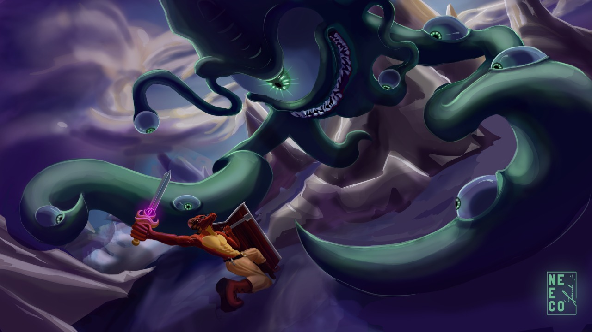

<h1> Olá!</h1>
<h2>
Esse é um projeto pessoal de página como portfólio.
</h2>
Site feito em Bootstrap/CSS/HTML5/JavaScript, para mostrar um pouco sobre mim e sobre minhas capacidades técnicas.
 
 
Utilizei ícones do Favicon.
Fontes do Google
e artes que eu produzi assim como o padrão de cores escolhido.
 
<h3>Artes</h3>
Se quiser ver mais das minhas ilustrações, (quase) todas estão disponíveis no meu
<a href=https://www.instagram.com/neecolart/> Instagram </a>
 
 

